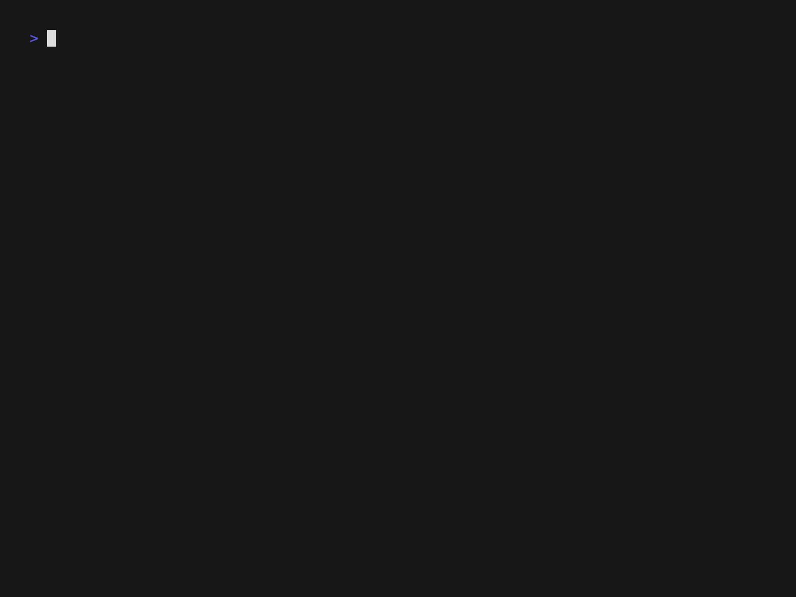

# dtctl

[](https://scorecard.dev/viewer/?uri=github.com/dynatrace-oss/dtctl)

[](https://github.com/dynatrace-oss/dtctl/releases/latest)
[](https://github.com/dynatrace-oss/dtctl/actions)
[](https://goreportcard.com/report/github.com/dynatrace-oss/dtctl)
[](LICENSE)
[](go.mod)

**Your Dynatrace platform, one command away.**

`dtctl` is a CLI for the Dynatrace platform. Manage workflows, dashboards, queries, and more from your terminal or let AI agents do it for you. Its predictable verb-noun syntax (inspired by `kubectl`) makes it easy for both humans and AI agents to operate.

```bash
dtctl get workflows                           # List all workflows
dtctl query "fetch logs | limit 10"           # Run DQL queries
dtctl apply -f workflow.yaml --set env=prod   # Declarative configuration
dtctl get dashboards -o json                  # Structured output for automation
```



> **Officially supported**: dtctl has been officially supported by Dynatrace since v1.0. Found a bug or have feedback? [Open a GitHub issue](https://github.com/dynatrace-oss/dtctl/issues/new) - that's our support channel.

---

## Install

```bash
# Homebrew (macOS/Linux)
brew install dynatrace-oss/tap/dtctl
```

```bash
# Shell script (macOS/Linux)
curl -fsSL https://raw.githubusercontent.com/dynatrace-oss/dtctl/main/install.sh | sh
```

```powershell
# PowerShell (Windows)
irm https://raw.githubusercontent.com/dynatrace-oss/dtctl/main/install.ps1 | iex
```

Binary downloads, building from source, shell completion setup, and more in the **[dtctl documentation](https://docs.dynatrace.com/docs/shortlink/dtctl-cli)** on docs.dynatrace.com.

## Authenticate

```bash
# OAuth login (recommended, no token management needed)
dtctl auth login --context my-env --environment "https://abc12345.apps.dynatrace.com"

# Verify everything works
dtctl doctor
```

Token-based authentication and multi-environment configuration are covered in **[docs/CONFIGURATION.md](docs/CONFIGURATION.md)**.

## Use with AI agents

dtctl is built for AI agents as much as for humans. The `--agent` flag wraps every response in a structured JSON envelope with stable error codes, `dtctl commands` prints a machine-readable command catalog, and `dtctl inventory` reports what data an environment holds. A bundled Agent Skill teaches AI coding assistants how to operate Dynatrace:

```bash
dtctl skills install              # Auto-detects your AI agent
```

Full agent-mode reference lives in the **[dtctl documentation](https://docs.dynatrace.com/docs/shortlink/dtctl-cli)** on docs.dynatrace.com.

## Observability

dtctl supports W3C Trace Context propagation and OTLP span export via the OpenTelemetry SDK. See [docs/OBSERVABILITY.md](docs/OBSERVABILITY.md) for full details on distributed tracing, environment variables, and CI/CD pipeline integration.

## Documentation

The full dtctl guide, orientation, supported resources, agent mode, and authentication overview lives on docs.dynatrace.com:

**[dtctl on docs.dynatrace.com](https://docs.dynatrace.com/docs/shortlink/dtctl-cli)**

For detailed, per-resource reference material, see the docs in this repo:

- **[docs/COMMANDS.md](docs/COMMANDS.md)** - full command reference (auto-generated): all verbs, flags, resource types, and aliases
- **[docs/CONFIGURATION.md](docs/CONFIGURATION.md)** - contexts, credentials, safety levels, apply hooks, aliases
- **[docs/resources/](docs/resources/)** - per-resource guides (workflows, DQL queries, dashboards and notebooks, SLOs, settings, cloud integrations, and more)

## Contributing

See [CONTRIBUTING.md](CONTRIBUTING.md) for guidelines.

## License

Apache License 2.0. See [LICENSE](LICENSE).
