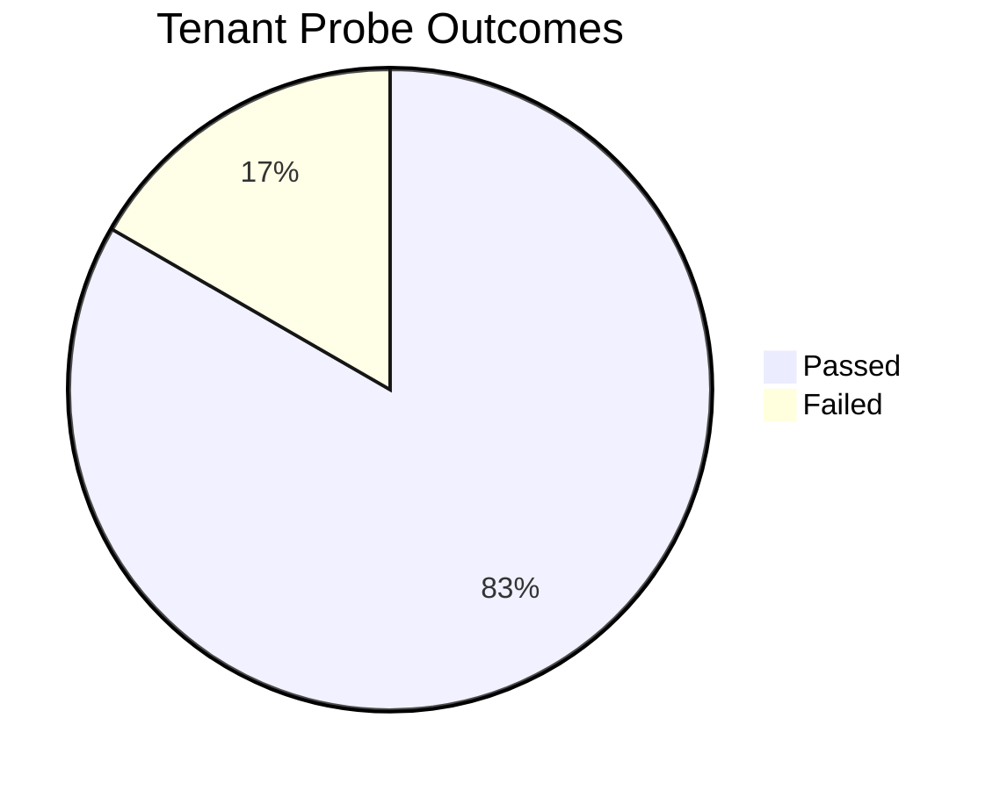
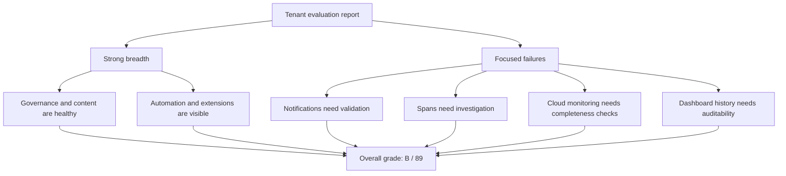
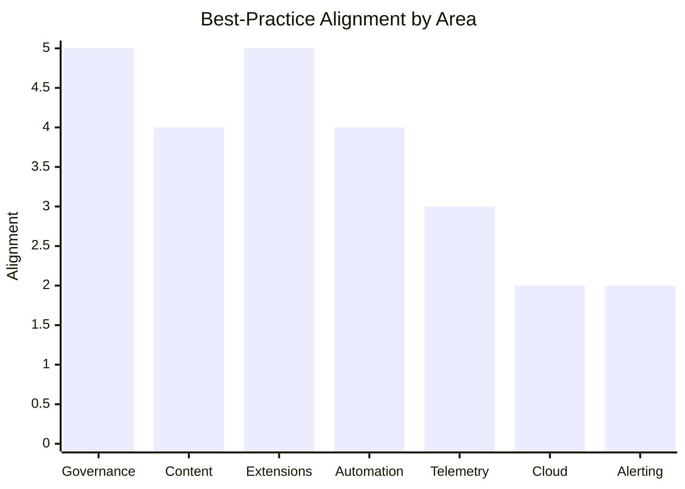
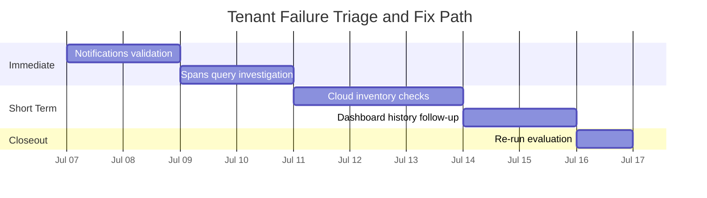

# Tenant Evaluation Best-Practices Report

## Summary

This report is an applied interpretation of the tenant evaluation in `report.md`, using the Dynatrace notebook corpus only as the best-practice lens.

It is intentionally tenant-specific:
- the source of truth is the 36-probe tenant assessment,
- the findings map to concrete domain results,
- and the recommendations are tied to the exact failed probes, not to notebook content in the abstract.

The tenant assessment is broadly healthy and well-covered:
- 36 probes completed
- grade B
- score 89/100
- 83% success rate
- 100% domain coverage
- 86% deep check rate
- 646 discovery signals

From a best-practices perspective, the tenant looks strong in:
- content and documentation presence,
- workflow and automation coverage,
- governance and platform configuration visibility,
- extension inventory and configuration,
- and dashboard/notebook discovery.

The main gaps are concentrated, not systemic:
- notifications inventory failed,
- spans query failed,
- AWS monitoring inventory failed,
- Azure monitoring inventory failed,
- GCP monitoring inventory failed due to preview limitations,
- and dashboard history failed for one sample dashboard.

The most important conclusion is that the tenant has good breadth, but several of the failing probes line up with areas where the best-practice library would expect stronger operational validation:
- alerting and notification readiness,
- telemetry querying and trace discovery,
- cloud integration completeness,
- and lifecycle/history hygiene for content assets.

## Visual Snapshot

### Probe Outcome Mix

### How the Evaluation Reads

### Best-Practice Alignment Heatline

## Tenant-Specific Highlights

The key tenant-level signal is not just the B grade. It is the distribution of success and failure across operationally meaningful surfaces.

| Tenant Probe Area | Concrete Result | Best-Practice Meaning |
|---|---|---|
| Alerting | `notifications_inventory` failed, while `analyzers_inventory` and `anomaly_detectors_inventory` succeeded | Detection exists, but delivery and notification validation is incomplete |
| Telemetry | `logs_query` succeeded, `spans_query` failed | Log analysis is ready, but trace-level investigation is blocked |
| Cloud | `aws_connections_inventory`, `azure_connections_inventory`, and `gcp_connections_inventory` succeeded, but the cloud monitoring inventory probes failed | Provider connections exist, but monitoring coverage is not consistently visible |
| Content | 110 dashboards, 3 notebooks, 172 documents discovered, but one dashboard history probe failed | The content surface is strong, but lifecycle traceability has a gap |
| Governance | `host_tags_query` and `management_zones_query` each returned 36 records | Governance metadata is a clear strength |
| Extensions | 27 extensions discovered and extension configuration probes succeeded | Extension operations are healthy and observable |

## Executive Summary

The tenant evaluation looks operationally viable, but not fully mature across every best-practice dimension.

### Executive Dashboard

| KPI | Value | Readout |
|---|---:|---|
| Grade | B | Good overall posture |
| Score | 89/100 | Strong but not complete |
| Success Rate | 83% | Most probes passed |
| Deep Check Rate | 86% | Solid validation depth |

| Signal | Value | Readout |
|---|---:|---|
| Domain Coverage | 100% | Full assessment spread |
| Discovery Signals | 646 | Healthy evidence base |
| Failed Probes | 6 | Focused remediation needed |
| Strongest Areas | Governance, Extensions, Content | Clear strengths |

If this evaluation were measured against a best-practices rubric, the strongest score would go to:
- documentation and content discoverability,
- governance and platform inventory,
- automation footprint,
- and general observability coverage.

The weakest score would go to:
- alerting/notification maturity,
- cloud monitoring completeness,
- span-level telemetry access,
- and dashboard history completeness.

This is consistent with a real-world pattern where a tenant has a solid observability base but some incomplete operational plumbing.

### Domain Heatmap

| Domain | Alignment | Visual | Interpretation |
|---|---:|---|---|
| Governance | 5/5 | █████ | Very strong metadata and organization |
| Content | 4/5 | ████░ | Large content footprint with a history gap |
| Extensions | 5/5 | █████ | Healthy extension inventory and configs |
| Automation | 4/5 | ████░ | Solid operational automation base |
| Telemetry | 3/5 | ███░░ | Logs are good, spans need work |
| Cloud | 2/5 | ██░░░ | Connections exist, monitoring is uneven |
| Alerting | 2/5 | ██░░░ | Detection exists, notification proof is missing |

## What Was Evaluated

The evaluation covered these domains:
- Alerting
- Automation
- Cloud
- Configuration
- Content
- Deployment
- Extensions
- Governance
- Kubernetes
- Platform
- Telemetry
- Topology

That is a very good spread for architecture review because it touches both platform capability and operational readiness.

## Why This Is Tenant Analysis

The notebook corpus is not the subject of the assessment here. It is the rubric.

The actual object under review is the tenant captured in `report.md`, including:
- discovered inventories,
- DQL-backed queries,
- configuration samples,
- dashboard and notebook history behavior,
- and the domain-level pass/fail pattern across the tenant.

That distinction matters because the report is meant to answer: what does this tenant actually tell us operationally?

## Best-Practice Lens

The Dynatrace best-practice notebook corpus suggests a useful lens for interpreting the tenant:

| Best-Practice Theme | What Good Looks Like | Tenant Signal |
|---|---|---|
| Foundations and adoption | Clear onboarding, naming, and access patterns | Strong governance and content presence |
| Data sources and instrumentation | Broad telemetry coverage across workloads and platforms | Strong logs and content, weaker spans and cloud monitoring |
| Data processing and analytics | Queryable data, usable dashboards, and reusable notebooks | Strong dashboards/notebooks, one dashboard history gap |
| Automation and workflows | Operationalized workflows and alerting | Workflows exist, notifications probe failed |
| Security and governance | Controlled access, policy patterns, extension hygiene | Good governance and extensions inventory |
| Migrations and validation | Clear stepwise readiness and validation signals | Mixed maturity, especially for cloud and telemetry edges |

## Score Interpretation

| Metric | Value | Interpretation |
|---|---:|---|
| Score | 89/100 | Strong overall, but not top-tier completeness |
| Grade | B | Good tenant with a few clear gaps |
| Success rate | 83% | Several failures are concentrated in important operational areas |
| Domain coverage | 100% | Very broad assessment surface |
| Deep check rate | 86% | Good depth for architecture validation |
| Discovery signals | 646 | Healthy evidence base |

## Domain Comparison Table

| Domain | Probes | Success | Failed | Discovery Items | Best-Practice Assessment |
|---|---:|---:|---:|---:|---|
| Alerting | 4 | 3 | 1 | 111 | Good signal, but notifications failure blocks a mature alerting posture |
| Automation | 3 | 3 | 0 | 2 | Solid operational automation foundation |
| Cloud | 6 | 3 | 3 | 3 | Weakest broad domain; cloud monitoring is not fully reliable here |
| Configuration | 2 | 2 | 0 | 2 | Healthy config surface |
| Content | 7 | 6 | 1 | 288 | Strong content footprint; history gap is the main issue |
| Deployment | 1 | 1 | 0 | 4 | Good deployment visibility |
| Extensions | 3 | 3 | 0 | 31 | Strong extension inventory and config coverage |
| Governance | 3 | 3 | 0 | 72 | Very strong governance and metadata presence |
| Kubernetes | 2 | 2 | 0 | 0 | No visible issues, but low discovery volume suggests limited or absent surface |
| Platform | 2 | 2 | 0 | 33 | Good platform-level inventory |
| Telemetry | 2 | 1 | 1 | 100 | Logs are good; spans access is the key weakness |
| Topology | 1 | 1 | 0 | 0 | Topology query succeeded, but the area is lightly exercised |

## Findings

### 1. Alerting is present, but notification readiness is incomplete

Evidence:
- `notifications_inventory` failed
- `analyzers_inventory` and `anomaly_detectors_inventory` succeeded

Interpretation:
- The tenant has alerting mechanisms and anomaly detection in place.
- However, the notification inventory failure means the alerting path is not fully validated end to end.

Best-practice implication:
- Alert detection without dependable notification delivery is not enough.
- This is a maturity gap because actionable alerts must reach recipients or workflows reliably.

Tenant-level conclusion:
- The alerting stack is partially mature, but the notification path is the missing proof point.

### 2. Telemetry coverage exists, but span-level query access is broken

Evidence:
- `logs_query` succeeded
- `spans_query` failed

Interpretation:
- The tenant can query logs effectively, which is a strong sign of telemetry ingestion and analytic readiness.
- The failure on spans indicates a gap in distributed tracing access, entitlement, or data availability.

Best-practice implication:
- A best-practice observability tenant should be able to move from logs to traces for root-cause analysis.
- The missing spans path reduces investigative depth.

Tenant-level conclusion:
- The tenant can support log-centric operations today, but distributed tracing is not yet dependable in the evaluation surface.

### 3. Cloud integrations are partially healthy but not operationally complete

Evidence:
- `aws_connections_inventory` succeeded
- `azure_connections_inventory` succeeded
- `gcp_connections_inventory` succeeded
- cloud monitoring inventories for AWS, Azure, and GCP failed

Interpretation:
- Source connections exist, but monitoring inventory is not consistently accessible across cloud providers.
- GCP failure is additionally constrained by preview status.

Best-practice implication:
- Connection alone is not the same as monitoring readiness.
- The tenant should verify provider-specific monitoring views and expected inventory behavior.

Tenant-level conclusion:
- Cloud onboarding exists, but cloud observability validation is uneven across providers.

### 4. Content assets are abundant, but lifecycle/history is uneven

Evidence:
- dashboards inventory returned 110 items
- notebooks inventory returned 3 items
- documents inventory returned 172 items
- one dashboard history probe failed
- notebook history returned no snapshots for the sample notebook

Interpretation:
- The tenant contains a meaningful content footprint.
- The history signal is uneven, which may be normal for some assets but still matters for change tracking and operational governance.

Best-practice implication:
- Best-practice repositories and production tenants both benefit from clear history and version traceability.
- Missing snapshots or failing history access reduces auditability.

Tenant-level conclusion:
- The tenant has enough content to be operationally useful, but not enough history reliability to feel fully governed.

### 5. Governance and platform metadata are strong

Evidence:
- `host_tags_query` succeeded with 36 records
- `management_zones_query` succeeded with 36 records
- `slos_inventory` returned 0, but the probe succeeded
- `segments_inventory` and `buckets_inventory` succeeded

Interpretation:
- The tenant has good metadata and governance structure.
- Even when some assets are absent, the platform surface is measurable and queryable.

Best-practice implication:
- Governance and organization appear to be a strength, which usually correlates with better long-term maintainability.

Tenant-level conclusion:
- This is one of the clearest strengths in the assessment and should be preserved while fixing the weaker operational areas.

### 6. Extension visibility is strong

Evidence:
- `extensions_inventory` succeeded with 27 items
- extension configuration probes succeeded

Interpretation:
- Extension management is operationally visible.
- The environment appears to have a meaningful third-party or custom extension footprint.

Best-practice implication:
- This aligns with a healthy platform operations model, especially when extension monitoring is validated alongside inventory.

Tenant-level conclusion:
- Extension operations look healthy enough to serve as a stable platform baseline.

## Probe-to-Action Map

| Failing Probe | What It Means Operationally | What to Do Next |
|---|---|---|
| `notifications_inventory` | Notification plumbing is not validated | Re-test with the intended auth/context and confirm the alert delivery path |
| `spans_query` | Trace-level investigation is not dependable | Check trace ingestion, entitlements, and query compatibility |
| `aws_monitoring_inventory` | AWS monitoring is not fully visible | Separate connection health from monitoring inventory health |
| `azure_monitoring_inventory` | Azure monitoring is not fully visible | Confirm provider-specific coverage and permissions |
| `gcp_monitoring_inventory` | GCP monitoring is constrained by preview behavior | Treat as limited evidence, not a hard failure only, and confirm product constraints |
| `dashboard_history_*` | Content lifecycle/audit trail is incomplete | Re-check another sample and validate whether history is missing or unsupported |

## Findings Table

| Finding | Severity | Evidence | Best-Practice Impact |
|---|---|---|---|
| Notifications inventory failed | High | `notifications_inventory` exit status 1 | Breaks end-to-end alerting maturity |
| Spans query failed | High | `spans_query` exit status 1 | Limits trace-based investigation |
| AWS monitoring inventory failed | Medium | `aws_monitoring_inventory` exit status 1 | Weakens cloud observability completeness |
| Azure monitoring inventory failed | Medium | `azure_monitoring_inventory` exit status 1 | Same as above for Azure |
| GCP monitoring inventory failed | Medium | Preview limitation | Valid but constrained; less reliable for strict evaluation |
| Dashboard history failed | Medium | `dashboard_history_*` exit status 1 | Reduces auditability and lifecycle validation |

## Comparison Against Best Practices

### Strong Alignment

The tenant aligns well with the best-practice model in these areas:
- platform governance,
- configuration inventory,
- extension management,
- dashboard and notebook presence,
- log-based telemetry analytics,
- and automation availability.

### Partial Alignment

The tenant aligns only partially in these areas:
- alert delivery and notification pathways,
- distributed tracing / spans discovery,
- cloud-provider monitoring inventories,
- and lifecycle history for dashboards and notebooks.

### Weakest Alignment

The tenant is weakest where best practices depend on validation rather than mere presence:
- “Can the tenant notify reliably?”
- “Can we investigate traces end to end?”
- “Can we confirm cloud monitoring inventories across providers?”
- “Can we audit dashboard or notebook history cleanly?”

That distinction matters because a tenant can look broad on paper while still failing the operational proof step.

## Applied Recommendations

### Priority 1: Fix notification inventory validation

Why:
- Alerting is only complete when notification pathways are visible and working.

Recommended action:
- Re-run notification inventory with the exact expected context and validate whether the failure is entitlement, configuration, or command behavior.
- Confirm that alerting rules can reach their destinations.

## Failure Timeline and Fix Path

The following is a remediation sequence, not a literal timestamp history. It shows the order that will produce the fastest signal gain.

| Step | Failure / Gap | Recommended Fix | Expected Outcome |
|---|---|---|---|
| 1 | Notifications inventory failed | Validate entitlements, config, and execution path | Alerting path becomes testable |
| 2 | Spans query failed | Check trace ingestion and DQL/query access | Trace-based investigation becomes available |
| 3 | Cloud monitoring inventories failed | Validate provider coverage separately | Cloud observability visibility improves |
| 4 | Dashboard history failed | Check another sample and confirm history support | Auditability improves |
| 5 | Re-run tenant evaluation | Re-score against the same rubric | Meaningful delta and cleaner evidence |

### Priority 2: Investigate spans query access

Why:
- Span access is essential for root-cause analysis in modern observability.

Recommended action:
- Check whether tracing data is ingested.
- Check whether the tenant has the correct query entitlement or whether trace data is absent.
- Validate the query shape against current DQL expectations.

### Priority 3: Separate cloud connection health from cloud monitoring health

Why:
- Inventory success on connections does not guarantee monitoring coverage.

Recommended action:
- Validate each provider separately:
  - connection exists,
  - monitoring inventory exists,
  - relevant resources are visible,
  - and preview limitations are accounted for.

### Priority 4: Strengthen dashboard and notebook history checks

Why:
- History is important for auditability and change tracking.

Recommended action:
- Confirm whether history is disabled, unsupported, or simply empty for the sample assets.
- Re-check another dashboard and notebook sample before concluding the capability is absent.

### Priority 5: Preserve the current strengths

Why:
- Governance, extensions, and content breadth are already good.

Recommended action:
- Do not disturb the working metadata and extension inventory patterns while troubleshooting the gaps.
- Use the healthy surfaces as anchor points for further validation.

## Recommended Triage Order

| Order | Area | Reason |
|---|---|---|
| 1 | Notifications | Highest impact on operational readiness |
| 2 | Spans | Highest impact on investigation depth |
| 3 | Cloud monitoring inventories | Broadest coverage gap across providers |
| 4 | Dashboard history | Auditability and lifecycle validation |
| 5 | GCP preview behavior | Lower priority because the limitation may be product-side |

## Conclusions

The tenant evaluation is good, but not fully mature.

The best-practice interpretation is:
- The tenant has strong foundational observability and governance.
- The tenant has visible content, workflow, extension, and configuration assets.
- The tenant is less consistent in end-to-end operational validation.

In practical terms:
- This is a solid environment for monitoring and platform management.
- It is not yet a flawless “best-practice complete” environment because key proof points still fail.

The most important gap is not volume; it is confidence.

The environment has enough assets and enough discovery signals to suggest real maturity, but the failing probes show that some critical operational paths still need validation.

## Final Verdict

Grade B is justified.

A score of 89/100 is consistent with:
- broad coverage,
- strong governance,
- and good content/automation visibility,
- offset by a few high-value failures in alerting, tracing, cloud monitoring, and history.

If the goal is architectural readiness, the tenant is close.
If the goal is best-practice completeness, it still needs targeted remediation.

## Next Best Step

The next best move is not necessarily to rerun the whole evaluation immediately.

The better step is to fix or validate the highest-value failure paths first, then rerun the same evaluation so the delta is meaningful:
- notifications
- spans
- cloud monitoring inventories
- dashboard history

If you want, I can also produce a shorter action plan version of this file that turns the findings into a concrete remediation checklist.
